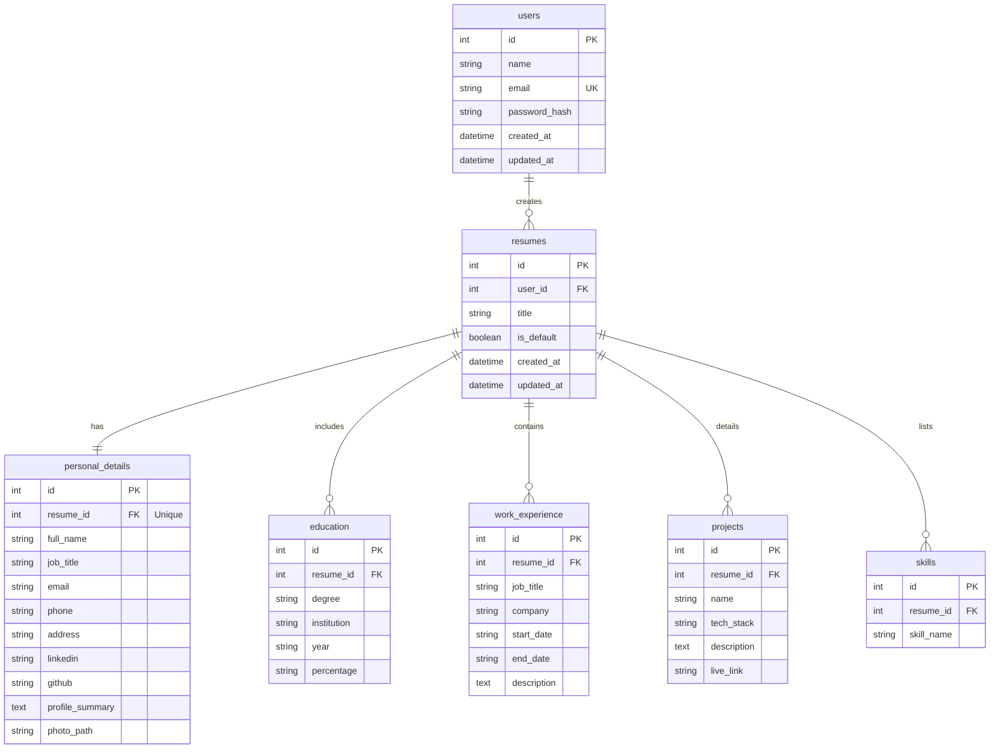

<div align="center">
  
  
  # 🚀 ResumeCraft
  ### **The Next-Generation AI-Powered Resume Builder & Profile Optimizer**
  
  *A robust, features-packed, and beautifully engineered Flask-based web application to craft ATS-compliant, recruiter-ready resumes in minutes.*

  ---

  [](https://www.python.org/)
  [](https://flask.palletsprojects.com/)
  [](https://sqlite.org/)
  [](https://weasyprint.org/)
  [](https://opensource.org/licenses/MIT)
  [](https://resume-craft-builder.onrender.com)

  **[✨ View Live Demo](https://resume-craft-builder.onrender.com)** • **[🐞 Report Bug](https://github.com/VarshneyParag/resume_builder/issues)** • **[💡 Request Feature](https://github.com/VarshneyParag/resume_builder/issues)**
</div>

<br />

## 📖 Table of Contents
1. [🌟 Executive Overview](#-executive-overview)
2. [✨ Key Features](#-key-features)
3. [🎨 UI/UX Design Philosophy](#-uiux-design-philosophy)
4. [🏗️ Technical Architecture & Database Design](#%EF%B8%8F-technical-architecture--database-design)
5. [🔒 Security-First Engineering](#-security-first-engineering)
6. [📂 Codebase Directory Map](#-codebase-directory-map)
7. [🌐 API Reference Sheet](#-api-reference-sheet)
8. [💻 Local Installation & Developer Setup](#-local-installation--developer-setup)
9. [🚀 Production Deployment Guide](#-production-deployment-guide)
10. [🤝 Contributing & Community Guidelines](#-contributing--community-guidelines)
11. [📄 License](#-license)
12. [⭐ Show Your Support](#-show-your-support)

---

## 🌟 Executive Overview
**ResumeCraft** is a state-of-the-art web platform engineered to empower job seekers by turning raw details into highly polished, **ATS-optimized** professional resumes. Built upon a solid Python/Flask backend and designed with a mobile-first, glassmorphic client interface, ResumeCraft solves the most common roadblocks in resume building: layout formatting, phrasing writer's block, multi-device access, and environment-dependent PDF export failures.

Unlike traditional static document creators, ResumeCraft offers dynamic optimization tips, real-time calculation of profile completeness, context-based AI text expansion, and a robust dual-compilation PDF rendering pipeline.

---

## ✨ Key Features
*   🤖 **AI Writing Assistant (`/api/ai-generate`)**: Integrates an intelligent generative text engine. Users who experience writer's block can auto-draft high-impact, action-verb-oriented bullet points tailored to specific roles (Developer, UX Designer, Product Manager, Analyst) and enriched with optional technical keywords.
*   📱 **Native App-like Mobile Experience**: Engineered with fluid bottom-navigation bars, responsive CSS Grid layout modules, floating status updates, and interactive accordion-style steppers that adapt natively to any screen size.
*   🎯 **ATS-Optimized Formatting**: Designed in collaboration with recruiting guidelines. Font sizing, hierarchy, margins, and section markers are optimized to pass automated ATS parsers (Applicant Tracking Systems) without parsing errors.
*   🖨️ **Dual-Engine PDF Compiler**: Solves local dependencies and server-side operating system styling conflicts by integrating:
    1.  **Server-Side compiled PDF engine**: Using *WeasyPrint* for high-fidelity paginated PDF rendering.
    2.  **Client-Side fallback compiler**: Utilizing `html2pdf.js` directly in the client browser, delivering zero-dependency, pixel-perfect exports directly to the user's local downloads.
*   📈 **Profile Optimizer & Completeness Engine**: Computes user profile progress in real-time based on structural data completion metrics. Delivers dynamic, contextual optimization checklists to guide users toward a 100% complete resume.
*   💾 **State Synchronization & Auto-Save**: Seamless asynchronous auto-saving via AJAX, ensuring that drafts are continuously backed up to the database without page reloads.
*   🔑 **Frictionless OAuth Simulator**: Quick, one-click access simulation using Google Account login patterns to streamline evaluation and onboarding.

---

## 🎨 UI/UX Design Philosophy
*   **Modern Glassmorphism**: Utilizes soft, semi-transparent backdrops (`backdrop-filter: blur()`), glowing gradients, and subtle border shadows to offer a highly premium aesthetic.
*   **Intuitive Split-Pane Editor**: Designed with side-by-side editing blocks and a live HTML-rendered preview pane, allowing immediate visual feedback.
*   **Micro-Animations**: Hover-triggered translations, smooth loading indicators, scaling effects, and accordion transitions built entirely on GPU-accelerated Vanilla CSS animations.
*   **Adaptive Theme System**: Integrated with CSS Custom Variables to allow robust, modular styling transitions.

---

## 🏗️ Technical Architecture & Database Design

### 📊 Database Schema Relationships
ResumeCraft implements a relational schema via **Flask-SQLAlchemy (SQLAlchemy 2.0)** on an SQLite database. It establishes strict cascade options, foreign key constraints, and relational indexes for optimal performance.



---

## 🔒 Security-First Engineering
*   **Robust Encryption**: Enforces industry-standard password hashing using PBKDF2 with SHA256 (via `werkzeug.security`) to ensure user credentials are safe.
*   **CSRF Protection**: Comprehensive Cross-Site Request Forgery security applied to all POST/PUT/DELETE forms utilizing `Flask-WTF`.
*   **SQL Injection Immunity**: Leverages SQLAlchemy's parameter-binding Object-Relational Mapper, completely isolating user inputs from query-execution context.
*   **Secure File/Avatar Uploads**: 
    - Verifies and filters files using safe extension limits.
    - Employs `Pillow` to validate image headers, neutralizing malicious payloads embedded in image headers.
    - Automates directory storage sanitization and cleans up stale assets on update or deletion.
*   **Proxy-Aware Middleware**: Uses Werkzeug's `ProxyFix` middleware to parse forward headers properly (`X-Forwarded-For`, `X-Forwarded-Proto`), ensuring secure session cookies (`HTTPS-only`) function correctly on cloud platforms like Render.

---

## 📂 Codebase Directory Map
Here is a comprehensive directory breakdown mapping the architecture of the application:

```text
resume_builder/
├── app.py                     # Main Entry Point: Route controllers & application configs
├── config.py                  # Environment-specific configuration options & constants
├── models.py                  # SQLAlchemy Database Schema Declarations & ORM Relationships
├── requirements.txt           # Python application dependencies
├── .env                       # Local environment secrets storage (excluded from git)
├── .gitignore                 # Specified directories and files ignored by git
├── pdf_generator/             # Server-side PDF export compiler module
│   ├── __init__.py
│   └── generator.py           # Core logic wrapping WeasyPrint and rendering fallback paths
├── static/                    # Frontend client-side resources
│   ├── css/
│   │   └── style.css          # Core layout styles, variables, & glassmorphism modules
│   └── js/
│       └── main.js            # Interactive app handler (stepper state, autosave AJAX, AI API)
├── templates/                 # Jinja2 template files
│   ├── base.html              # Core navigation layout and script imports
│   ├── index.html             # Landing page with product marketing, features & pricing
│   ├── login.html             # Secure user authentication interface
│   ├── register.html          # New account registration form
│   ├── dashboard.html         # User portal: showcases saved resumes, completeness metrics, & tips
│   ├── resume_form.html       # The main builder screen: split edit/preview with AI assist panels
│   ├── resume_preview.html    # Full-screen template layout for printing and viewing
│   ├── pdf_template.html      # Specific print template designed for WeasyPrint layout styling
│   └── settings.html          # Profile settings panel for passwords and email updates
└── utils/                     # Shared system helper modules
    ├── __init__.py
    ├── helpers.py             # File saving routines, directory creations, deletion rules
    └── validators.py          # Email, name length, and password strength regex validation engines
```

---

## 🌐 API Reference Sheet

### AI Text Generation Endpoint
Allows the frontend workspace to generate professional suggestions based on roles and key competencies.

*   **URL**: `/api/ai-generate`
*   **Method**: `POST`
*   **Auth Required**: Yes (`@login_required`)
*   **Headers**: `Content-Type: application/json`
*   **Payload Example**:
    ```json
    {
      "section": "experience",
      "role": "Full Stack Developer",
      "keywords": "Flask, React, SQL, AWS"
    }
    ```
*   **Success Response** (`200 OK`):
    ```json
    {
      "status": "success",
      "generated_text": "• Developed robust modules leveraging Flask, React, SQL, AWS to meet performance objectives.\n• Led the design, development, and deployment of scalable microservices, improving platform stability by 35%."
    }
    ```

### Detailed Route Directory

| Endpoint Route | HTTP Method | Auth Required | Description |
| :--- | :--- | :---: | :--- |
| `/` | `GET` | No | Render marketing landing page |
| `/login` | `GET`, `POST` | No | Display login / process session credentials |
| `/register` | `GET`, `POST` | No | Display signup / create a new user profile |
| `/logout` | `GET` | Yes | Terminate current user session |
| `/dashboard` | `GET` | Yes | Load user dashboard with list of resumes and tips |
| `/resume/create` | `GET`, `POST` | Yes | Generate a new database resume record |
| `/resume/<id>` | `GET` | Yes | Open interactive workspace builder form |
| `/resume/<id>/update` | `POST` | Yes | Commit complete updates to specific resume |
| `/resume/<id>/autosave` | `POST` | Yes | AJAX-based autosave for title and summary fields |
| `/resume/<id>/delete` | `POST` | Yes | Delete resume record and clean up associated image |
| `/resume/<id>/set-default` | `POST` | Yes | Assign default display resume for user account |
| `/resume/<id>/preview` | `GET` | Yes | Load print-friendly preview screen |
| `/resume/<id>/download-pdf`| `GET` | Yes | Export resume as PDF via server/client fallback |
| `/login/google` | `GET` | No | Simulate Google account single sign-on authentication |
| `/settings` | `GET`, `POST` | Yes | Render and process user profile credentials updates |

---

## 💻 Local Installation & Developer Setup

Setting up ResumeCraft on a local machine takes under 5 minutes:

### Prerequisites
*   Python 3.8 or higher installed on your machine.
*   *Optional:* [WeasyPrint dependencies](https://doc.courtbouillon.org/weasyprint/stable/first_steps.html#installation) if you plan to compile high-fidelity PDFs on the server side. (If WeasyPrint dependencies are missing, the system automatically uses client-side PDF rendering dynamically!)

### 1. Clone the repository
```bash
git clone https://github.com/VarshneyParag/resume_builder.git
cd resume_builder
```

### 2. Configure Virtual Environment
Establish a virtual environment to manage dependencies:
```bash
# On Windows:
python -m venv venv
venv\Scripts\activate

# On macOS/Linux:
python3 -m venv venv
source venv/bin/activate
```

### 3. Install Required Dependencies
Install the required application stack:
```bash
pip install -r requirements.txt
```

### 4. Setup Local Configuration
Create an environment file named `.env` in the root workspace directory:
```env
FLASK_APP=app.py
FLASK_ENV=development
SECRET_KEY=enter-a-highly-secure-secret-key-here
UPLOAD_FOLDER=uploads/photos
DATABASE_URI=sqlite:///resume_builder.db
```

### 5. Launch the Application
Start the development server:
```bash
python app.py
```
Open **`http://localhost:5000`** in your browser. The application database (`instance/resume_builder.db`) will initialize automatically on start!

---

## 🚀 Production Deployment Guide

ResumeCraft is fully configured for deployment on modern cloud platforms (Render, Heroku, Railway, etc.).

### Deploying to Render.com
1.  **Create Web Service**: Connect your fork of the GitHub repository.
2.  **Environment Selection**: Choose `Python` as the runtime.
3.  **Build Command**: Set up installation parameters:
    ```bash
    pip install -r requirements.txt
    ```
4.  **Start Command**: Run the production WSGI server using `Gunicorn`:
    ```bash
    gunicorn app:app
    ```
5.  **Environment Variables**: Input the production configuration keys:
    *   `SECRET_KEY`: *[A long secure cryptographic string]*
    *   `FLASK_ENV`: `production`

---

## 🤝 Contributing & Community Guidelines
Contributions are the lifeblood of open-source software! If you want to improve ResumeCraft, please follow these steps:

1.  **Fork** the project repository.
2.  **Create your branch** for the feature (`git checkout -b feature/AmazingFeature`).
3.  **Commit** your updates (`git commit -m 'Implement AmazingFeature'`).
4.  **Push** changes to the origin branch (`git push origin feature/AmazingFeature`).
5.  **Submit a Pull Request** explaining your enhancements.

---

## 📄 License
Distributed under the **MIT License**. Check the [LICENSE](LICENSE) file for more information.

---

## ⭐ Show Your Support
If ResumeCraft helped you design your resume, land a job opportunity, or taught you something new about Flask, please **give this repository a Star (⭐)**! It helps other developers find the project and keeps the author motivated to release new features.

<div align="center">
  <p>Crafted with dedication and passion by <a href="https://github.com/VarshneyParag">Parag Varshney</a>.</p>
</div>
